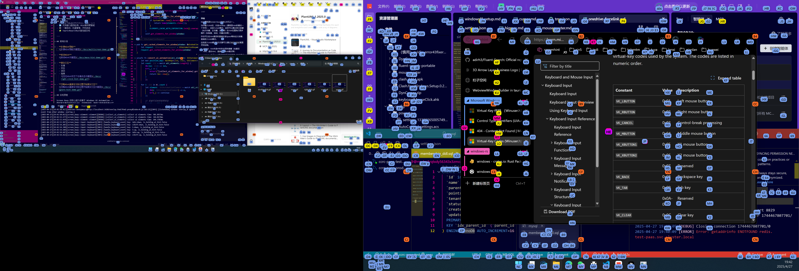

# Screen Buoy

[English](./README.md) | [中文](./README_zh.md)

> A cross-screen, fully interactive screen hint navigation and automation tool.
> Inspired by Fluent Search and mousemaster, with enhanced multi-monitor and advanced interaction support.

---

## Background & Motivation

Typical scenarios:
- Quickly switch focus across multiple monitors
- Generate hints anywhere on the screen, not just on clickable elements
- Support for advanced interactions: long-press, combo keys, arrow keys, scrolling, dragging, etc.

---

## Key Features

- 🖥️ Global hint navigation across multiple monitors
- 🟦 Hints can appear in blank areas, not just on clickable elements
- ⌨️ Rich keyboard interactions: long-press, combos, arrow keys, scroll, drag, etc.
- 🛠️ Fully configurable hint styles, types, and behaviors
- 🪟 Window occlusion detection for smarter hint ordering
- 🏁 One-click launch, tray management, auto-start on boot
- 🧩 High performance: Tauri + React + Rust

## Demo

- **Multi-monitor hint navigation**
  

- **Move hints**
  

- **Advanced interactions**
  - Right click
    
  - Double click
    
  - Scroll
    
  - Drag
    

- **Start advanced interaction at cursor without hint**
  

---

## How It Works

Screen Buoy is powered by Windows UI Automation — the official Microsoft API for enumerating and interacting with all UI controls (buttons, textboxes, windows, menus, etc.) across processes and windows.

The backend (Tauri, Rust) integrates UI Automation as follows:

- Uses the Rust `windows` crate to call UI Automation COM interfaces and enumerate all desktop windows and controls
- Retrieves each control's type (ControlType), name, visibility, interactivity, screen coordinates, window z-order, etc.
- Applies custom control type mapping and filtering rules to generate hint candidates
- Supports multi-monitor, multi-window, and occlusion detection
- Passes control and hint data to the frontend/overlay for rendering and interaction

With UI Automation, Screen Buoy can precisely capture and operate on all visible windows and controls, providing a robust foundation for global hint navigation and automation.

---

## Installation & Usage

#### Method 1: Download (Recommended)

1. Go to the [Releases page](https://github.com/alvinfunborn/screen-buoy/releases) and download the latest `ScreenBuoy.exe` and `config.toml`.
2. Place both files in the same directory.
3. Double-click `ScreenBuoy.exe` to launch. The ScreenBuoy tray icon will appear.
4. To customize, edit `config.toml` in the same directory and restart the program.

- **Tray icon**: Double-click to open settings
- **Auto-start**: Can be enabled in settings
- **Configuration**: See `config.toml`

#### Method 2: Build from Source

```bash
# Clone the repository
git clone https://github.com/alvinfunborn/screen-buoy.git
cd screen-buoy

# Install dependencies
npm install

# Build the Tauri backend
cd src-tauri
cargo build

# Start in development mode
cd ..
npm run tauri dev

# Build the release version
npm run tauri build
```

- **Tray icon**: Double-click to open settings
- **Auto-start**: Can be enabled in settings
- **Configuration**: See `src-tauri/config.toml`

---

## Default Key Bindings

- When running:
  - `Alt+H`: Show hints
- When hints are visible:
  - `Esc`: Exit hint mode
  - Short press `HintKey`: Left click at hint and exit
  - Long press `HintKey`: Enter Hold mode at hint
  - Short press `Space`: Left click at cursor and exit
  - Long press `Space`: Enter Hold mode at cursor
  - Arrow keys: Move hints
- In Hold mode:
  - `Esc`: Exit hint mode
  - `LShift`: Left click
  - `HintLeftKey`: Left click and exit
  - `Enter`: Double click
  - `RShift`: Right click
  - `HintRightKey`: Right click and exit
  - Arrow keys: Drag
  - `ESDF`/`IJKL`: Scroll

---

## Advanced Configuration

#### 1. HintKey, HintRightKey, HintLeftKey

- **HintKey**: The main hint trigger key (usually the last character of the hint), used to activate, move to, or left-click at the hint.
- **HintRightKey**: When held with HintKey, triggers right-click or other extended actions.
- **HintLeftKey**: When held with HintKey, triggers left-click or other custom actions.

All these keys can be customized in the `keybinding` section.

#### 2. Keyboard Configuration

- **propagation_modifier**: Modifier keys (Ctrl, Alt, Win, etc.) that are passed through when hints are active.
- **available_key**: All available keys and their codes for custom binding.
- **map_left_right**: Define left/right mapping for certain keys for flexible combos.

Example:
```toml
[keyboard]
propagation_modifier = ["LCtrl", "RCtrl", "LAlt", "RAlt", "LWin"]
[keyboard.available_key]
Back = 8
Tab = 9
...
[keyboard.map_left_right.K]
right = "L"
```

#### 3. Keybinding Configuration

**keybinding** defines all shortcut bindings for Screen Buoy operations. You can flexibly configure behaviors for different scenarios.

###### Hold At Hint

**Hold At Hint** is a core interaction:
After entering a hint, long-pressing the HintKey (the last character of the hint) enters Hold mode, allowing advanced actions (drag, scroll, right-click, etc.) at the hint.
You can also long-press Space (or other custom keys) to enter Hold mode at the current cursor position.
All entry methods for Hold mode can be customized via the `hold_at_hint` setting.

###### Structure

- **global**: Shortcuts when no hint is selected (e.g., show hint, exit, enter Hold mode, etc.)
- **at_hint**: Shortcuts in Hold mode (e.g., left click, right click, double click, drag, scroll, etc.)

Example:
```toml
[keybinding.global]
move_to_hint = ["HintKey"]
exit = ["Esc"]
hold_at_hint = ["HintKey", "Space"]

[keybinding.at_hint]
left_click = ["LShift"]
right_click_exit = ["RShift", "HintRightKey"]
double_click = ["Enter"]
```
You can add, remove, or modify these bindings as needed for a personalized experience.

#### 4. Hint Grid Configuration

- **rows/columns**: Number of grid rows and columns.
- **show_at_rows/show_at_columns**: Which rows/columns to show hints in.
- **hint_type**: The type of hint for this grid (links to style/behavior).

Example:
```toml
[hint.grid]
rows = 4
columns = 5
show_at_rows = [1, 2, 3, 4]
show_at_columns = [1, 2, 3, 4, 5]
hint_type = "default"
```

#### 5. Hint Style Configuration

- **style**: Custom CSS for each hint type (background, font, border, etc.)
- **z_index**: Layer order for different hint types
- **element_control_types**: Control types associated with this hint type

Example:
```toml
[hint.types.button]
style = """
{
  background-color: rgba(122, 164, 243, 1);
  color: #111111;
  font-size: 11px;
}
"""
z_index = 4
element_control_types = [50021, 50026, ...]
```

---

## Performance

Screen Buoy is designed for high efficiency and low resource usage.
- **Memory usage**: Typically 30~60MB RAM when running in the background.
- **CPU usage**: Idle CPU usage is usually less than 1%, even with frequent UI Automation scans.
- **Startup time**: Less than 1 second on most modern systems.
- **Background threads**: Only a few lightweight threads for UI Automation and event hooks.

Screen Buoy is suitable for always-on use, even on multi-monitor setups and low-end hardware.

---

## Security

Screen Buoy is open source and has passed multiple security checks:
- **No network upload**: The application does not upload any user data or telemetry.
- **No backdoors or malicious code**: All source code is available for audit.
- **Antivirus scan**: The official release binary has been scanned by Windows Defender, Kaspersky, and Virustotal, with no threats detected.
- **Permissions**: Only requires standard user privileges; no system-level or kernel access.

[Virustotal scan report](https://www.virustotal.com/gui/file/9e29999b238e0d2b9f5e39affc1e5e7b41ff1008be3e2dfa4a3982071390dae1/detection)

You can verify the binary with any mainstream antivirus or use the source code to build your own trusted version.

---

## Appendix

- [Windows Virtual Key Codes](https://docs.microsoft.com/en-us/windows/win32/inputdev/virtual-key-codes)
- [Windows UI Automation Element Control Types Ids](https://learn.microsoft.com/en-us/windows/win32/winauto/uiauto-controltype-ids)

---

## References

- [Fluent Search](https://www.fluentsearch.net/)
- [mousemaster](https://github.com/petoncle/mousemaster)
