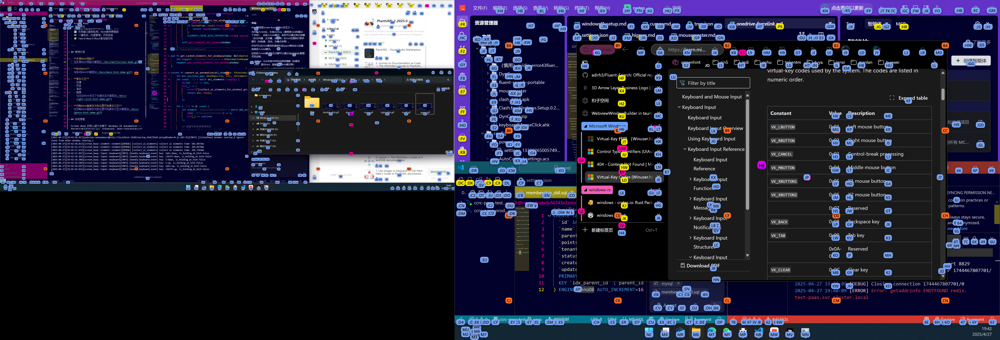

# Screen Buoy

> 跨屏幕、全局可交互的屏幕Hint导航与自动化工具  
> 灵感源自Fluent Search与mousemaster，支持多屏与复杂交互

---

## 需求背景

典型场景：
- 多屏下快速切换焦点
- 在任意区域生成Hint并自定义操作
- 支持长按、组合键、方向键等高级交互

---

## 核心特性

- 🖥️ 跨多显示器全局Hint导航
- 🟦 支持空白区域Hint，非仅可点击元素
- ⌨️ 丰富的键盘交互（长按、组合、方向键、滚轮、拖拽等）
- 🛠️ 完全可配置的Hint样式、类型、行为
- 🪟 支持窗口遮挡检测，Hint顺序更智能
- 🏁 一键启动、托盘管理、开机自启
- 🧩 Tauri+React+Rust高性能实现

---

## 使用示例

- **多屏Hint导航**  
  

- **移动Hint**
  

- **复杂交互**
  - 右键
  
  - 双击
  
  - 滚动
  
  - 拖拽
    

- **忽略Hint直接在光标位置开始复杂交互**
  

---

## 实现原理

Screen Buoy 的核心能力依赖于 Windows UI Automation —— 微软官方提供的自动化API，能够跨进程、跨窗口地枚举所有UI控件（如按钮、文本框、窗口、菜单等）。

本项目通过 Tauri 后端（Rust）集成 Windows UI Automation，主要流程如下：

- 利用 Rust 的 `windows` crate 调用 UI Automation COM 接口，枚举所有桌面窗口和控件
- 获取每个控件的类型（ControlType）、名称、可见性、可交互性、屏幕坐标、窗口层级等属性
- 结合自定义控件类型映射和过滤规则，生成 Hint 候选点
- 支持多屏幕、多窗口、遮挡检测等复杂场景
- 后端将控件信息和 Hint 数据传递给前端/Overlay 进行渲染和交互

通过 Windows UI Automation，Screen Buoy 能够实现对所有可见窗口和控件的精准捕捉和操作，为全局 Hint 导航和自动化交互提供底层支撑。

---

## 安装与使用

##### 方式一：直接下载

1. 前往 [Releases 页面](https://github.com/alvinfunborn/screen-buoy/releases) 下载最新的 `ScreenBuoy.exe` 和 `config.toml` 文件。
2. 将 `ScreenBuoy.exe` 和 `config.toml` 放在同一目录下。
3. 双击运行 `ScreenBuoy.exe`，系统托盘会出现ScreenBuoy图标。
4. 如需自定义配置，可直接编辑同目录下的 `config.toml` 文件，保存后重启程序生效。

- **托盘图标**：双击可打开设置界面
- **开机自启**：可在设置中开启
- **配置文件**：详见`config.toml`

##### 方式二：源码编译运行

```bash
# 克隆仓库
git clone https://github.com/alvinfunborn/screen-buoy.git
cd screen-buoy

# 安装依赖
npm install

# 构建Tauri后端
cd src-tauri
cargo build

# 开发模式启动
cd ..
npm run tauri dev
```

- **托盘图标**：双击可打开设置界面
- **开机自启**：可在设置中开启
- **配置文件**：详见`src-tauri/config.toml`

---

## 默认键位

- 运行时
  - Alt+H: 显示Hint
- Hint显示时
  - Esc: 退出Hint
  - 短按HintKey: 在Hint位置左键点击并退出
  - 长按HintKey：在Hint位置进入Hold模式
  - 短按Space：在鼠标光标位置左键点击并退出
  - 长按Space：直接在光标位置进入Hold模式
  - 方向键: 移动Hint
- Hold模式: 
  - Esc: 退出Hint
  - LShift: 左键点击
  - HintLeftKey: 左键点击并退出
  - Enter: 双击
  - RShift: 右键点击
  - HintRightKey: 右键点击并退出
  - 方向键: 拖拽
  - ESDF/IJKL: 滚动

---

## 高级设置

##### 1. HintKey, HintRightKey, HintLeftKey

- **HintKey**：主Hint触发键(Hint的最后一位字符)，通常用于激活Hint、移动到Hint位置、执行主操作（如左键点击）。
- **HintRightKey**：在长按HintKey的基础上，按下此键可触发右键点击等扩展操作。
- **HintLeftKey**：在长按HintKey的基础上，按下此键可触发左键点击或其它自定义操作。

这些按键可在`keybinding`配置中自定义，适配不同用户习惯。

##### 2. keyboard配置的按键注册

- **propagation_modifier**：指定哪些修饰键（如Ctrl、Alt、Win）在Hint激活时会被传递。
- **available_key**：定义所有可用的按键及其对应的键码，便于自定义绑定。
- **map_left_right**：为部分按键定义"左/右"映射关系，支持更灵活的组合操作。

示例：
```toml
[keyboard]
propagation_modifier = ["LCtrl", "RCtrl", "LAlt", "RAlt", "LWin"]
[keyboard.available_key]
Back = 8
Tab = 9
...
[keyboard.map_left_right.K]
right = "L"
```

##### 3. keybinding配置的按键绑定

**keybinding**用于定义Screen Buoy各类操作的快捷键绑定。你可以根据自己的习惯，灵活配置不同场景下的按键行为。

###### Hold At Hint说明

**Hold At Hint**是Screen Buoy的核心交互方式之一。当你输入Hint后，长按HintKey（Hint的最后一个字符），会进入Hold模式，此时可以在Hint位置执行更多操作（如拖拽、滚动、右键点击等）。  
你也可以在Hint激活时直接长按Space等自定义按键，直接在当前鼠标光标位置进入Hold模式。  
这些进入Hold模式的方式都可以通过`hold_at_hint`配置灵活定制。

###### 配置结构

- **global**：Hint未选中时的全局快捷键（如左键点击、退出Hint、直接进入Hold模式等）
- **at_hint**：处于Hold模式时的操作快捷键（如左键点击、右键点击、双击、拖拽、滚轮等）

**示例：**
```toml
[keybinding.global]
move_to_hint = ["HintKey"]
exit = ["Esc"]
hold_at_hint = ["HintKey", "Space"]

[keybinding.at_hint]
left_click = ["LShift"]
right_click_exit = ["RShift", "HintRightKey"]
double_click = ["Enter"]
```
你可以根据自己的需求，增删或修改这些绑定，实现个性化的Hint交互体验。

##### 4. hint grid配置

- **rows/columns**：指定网格的行数和列数。
- **show_at_rows/show_at_columns**：指定在哪些行/列显示Hint，支持灵活定制。
- **hint_type**：指定该网格Hint的类型，可关联不同的样式和行为。

示例：
```toml
[hint.grid]
rows = 4
columns = 5
show_at_rows = [1, 2, 3, 4]
show_at_columns = [1, 2, 3, 4, 5]
hint_type = "default"
```

##### 5. hint style配置

- **style**：自定义CSS样式，支持背景色、字体、边框等。
- **z_index**：控制不同类型Hint的层级，避免遮挡。
- **element_control_types**：指定该类型Hint关联的控件类型（如按钮、文本框等）。

示例：
```toml
[hint.types.button]
style = """
{
  background-color: rgba(122, 164, 243, 1); 
  color: #111111; 
  font-size: 11px;
}
"""
z_index = 4
element_control_types = [50021, 50026, ...]
```

---

## 性能

Screen Buoy 追求高效与低资源占用：  
- **内存占用**：常驻后台时约 30~60MB。
- **CPU 占用**：即使频繁扫描 UI，空闲时 CPU 占用通常低于 1%。
- **启动速度**：大多数现代设备下启动时间小于 1 秒。
- **后台线程**：仅有少量轻量线程用于 UI Automation 和事件钩子。

即使多屏、低配设备也可常驻运行，无明显性能压力。

---

## 安全性

Screen Buoy 完全开源，并通过多项安全检测：
- **无网络上传**：程序不会上传任何用户数据或遥测信息。
- **无后门/恶意代码**：全部源码可审计，官方发布包无任何后门。
- **杀毒扫描**：官方 release 版已通过 Windows Defender、卡巴斯基、Virustotal 等主流杀毒软件检测，无报毒。
- **权限需求**：仅需普通用户权限，无需系统级或内核级访问。

[Virustotal 检测报告](https://www.virustotal.com/gui/file/9e29999b238e0d2b9f5e39affc1e5e7b41ff1008be3e2dfa4a3982071390dae1/detection)

你可自行用主流杀毒软件验证，或直接编译源码获得可信版本。

---

## 附录

- [Windows Virtual Key Codes](https://docs.microsoft.com/en-us/windows/win32/inputdev/virtual-key-codes)
- [Windows UI Automation Element Control Types Ids](https://learn.microsoft.com/en-us/windows/win32/winauto/uiauto-controltype-ids)

---

## 参考项目

- [Fluent Search](https://www.fluentsearch.net/)  
- [mousemaster](https://github.com/petoncle/mousemaster)  

---
